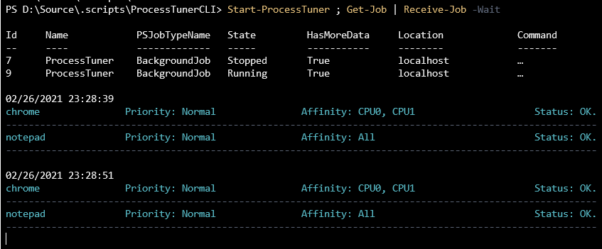

[](https://github.com/jsoliveir/ProcessTunerCLI/actions/workflows/tests.yml)
# What the Process Tuner is
> Powershell 5.0+ | Powershell Core 5.0+

ProcessTuner is a tool that manages CPU priorites for processes running in a given operating system. 

The tool can be helpful to restrict the number of CPUs Cores assigned for running processes or make some applications running on higher priorities than others.


# The Problem ...

1. Given you have an I5 machine as an example (4 Cores)

2. The machine is running applications and services backed by processes ...

3. You figure out that a specifc process, for some reason, is consumming 100% of your total CPU power ...

4. You concluded that it is "burning" the machine resources and is the operating system is completly hanged.

## What would you do?

The first approach would be to find and kill the process but, sometimes that cannot be done.

If the process is an Antivirus, an application running in a server you might need it running and in this case, would be really good if we could control CPU resources (priorities) for that given process. 

ProcessTuner allows to set CPU affinities/priorities for processes running the the operating system. 
That means that you can isolate processes in specific CPU cores, making them slower, but letting the operating system responsive enough to work on more important tasks.

For the problematic scenario above, you could use this tool to create a `Rule` for that  given process. You would set the CPU affinity to [CPU1] and priority to [Idle].
That mean that 100% of CPU power for that process will be only 25% of your total CPU capacity and other processes that might need the [CPU1] will have higher priority in terms of tasks processing.

# How to use it

## Install

```powershell
Install-Module ProcessTuner
```

## Import

```powershell
Import-Module ProcessTuner -Force
```

## List

```powershell
Get-Module ProcessTuner
```

## Update

```powershell
Update-Module ProcessTuner
Import-Module ProcessTuner -Force
```

## Create rules
```powershell
    New-ProcessRule `
      -Selector /system32 `
      -Priority High

    New-ProcessRule `
       -Affinity CPU0,CPU1,CPU2 `
       -Priority BelowNormal `
       -Selector notepad  `
    
    New-ProcessRule `
       -Affinity CPU5,CPU6,CPU7 `
       -Priority AboveNormal 
       -Selector chrome  `
```

## Remove rules
```powerhell
    Remove-ProcessRule `
       -Selector /system32
      
    Remove-ProcessRule `
       -Priority High

    Remove-ProcessRule `
       -Selector /system32  `
       -Affinity CPU0,CPU2  `
```

## Check existing rules
```powerhell
Get-ProcessRules
```
    selector priority         affinity
    -------- --------         --------
    chrome   RealTime CPU0, CPU1, CPU2
    code         High              All
    .*         Normal              All

## Apply the rules once (testing)

``` powershell
Get-ProcessRules | Set-ProcessRules
```

## Start auto management (attached)
``` powershell
Start-ProcessTuner 
```

## Start auto management (background / dettached)

``` powershell
Start-ProcessTuner -Background
```

## Extra args

``` powershell
Start-ProcessTuner `
    -RulesPath rules/example.yml `
    -Interval 10 `
    -Background
```


## Check the logs (background)

``` powershell
Get-Job ProcessTuner | Receive-Job -Keep
```

## Attach to the job (realtime)
``` powershell
Get-Job ProcessTuner | Receive-Job -Wait
```

# 



# 

## Hide/Minimize current the console window

``` powershell
Set-WindowStyle -Style MINIMIZE
```

``` powershell
Set-WindowStyle -Style MAXIMIZE
```

``` powershell
Set-WindowStyle -Style SHOWDEFAULT
```


Allowed Window Styles:

    'FORCEMINIMIZE', 'HIDE', 'MAXIMIZE', 'MINIMIZE', 'RESTORE', 
    'SHOW', 'SHOWDEFAULT', 'SHOWMAXIMIZED', 'SHOWMINIMIZED', 
    'SHOWMINNOACTIVE', 'SHOWNA', 'SHOWNOACTIVATE', 'SHOWNORMAL'


# Configurations 

By default ProcessTuner looks for a file named by `rules.yml` in the current working directory.

If any configuration file could not be found ProcessTuner will look for it in the parent directories.

If the configuration is still not found the one existing in the $HOME will be used.

To see what file is being using run the following command:

## Get the current config file path

```powershell
 Get-ProcessConfigFile
 ```


